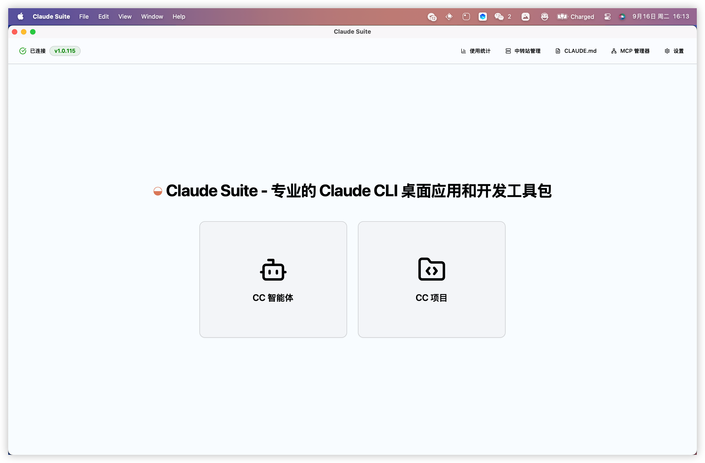
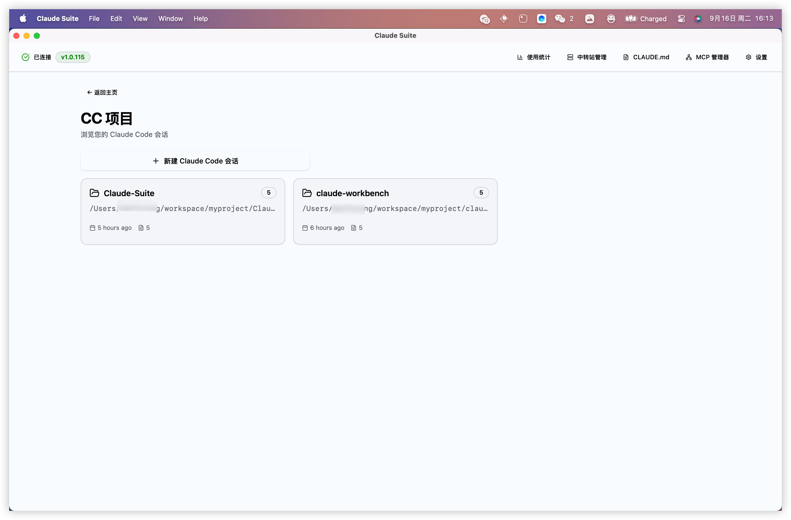
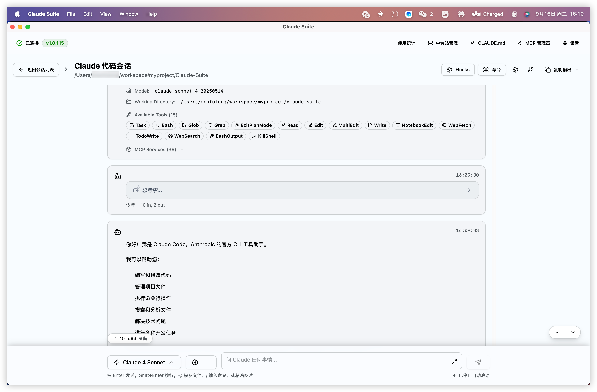
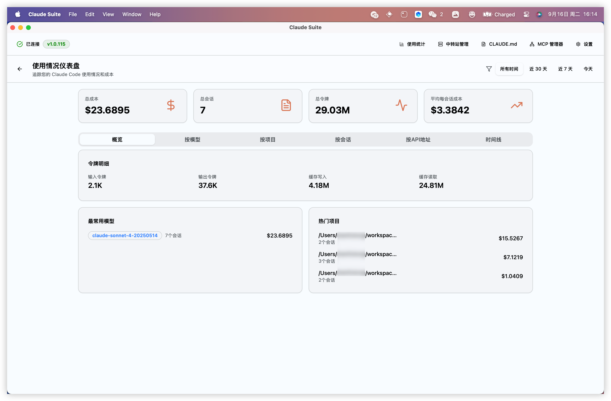
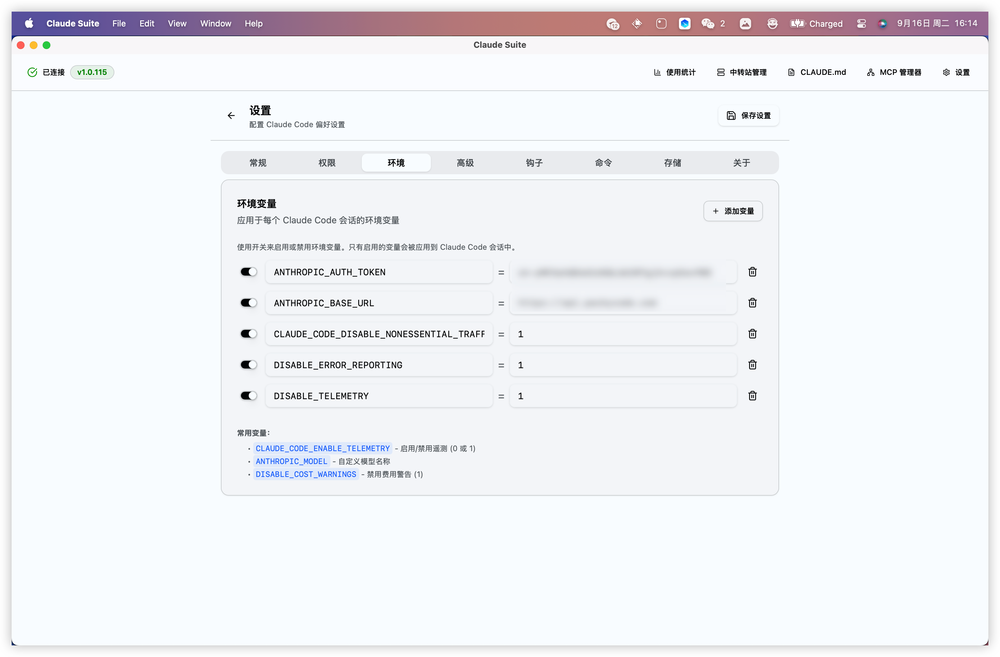

## Claude Suite

专业的 Claude CLI 桌面应用和开发工具包 - macOS 优化版

### 🎯 核心功能特性

**📁 智能项目管理**
- 可视化管理所有 Claude Code 项目
- 项目活动时间追踪和会话历史
- 一键创建新的 Claude Code 会话
- 项目路径智能识别和管理

**💬 强大的 AI 交互界面**
- 实时流式 Claude 响应显示
- 支持 15+ 专业开发工具 (Task、Bash、Glob、Grep、Read、Edit、Write 等)
- 完整的 MCP (Model Context Protocol) 支持 (39个服务)
- Markdown 渲染和代码语法高亮
- 多模型支持 (Claude 4 Sonnet 等)

**📊 详细使用统计分析**
- 实时费用监控和成本分析
- Token 使用量统计 (输入/输出)
- 会话数量和使用趋势
- 热门项目和模型使用分析
- 平均会话成本计算

**⚙️ 完整配置管理**
- 环境变量可视化管理
- API 令牌和基础 URL 配置
- Claude CLI 参数自定义
- 一键添加/编辑/删除配置项

**🍎 macOS 深度优化**
- 智能 PATH 检测，自动扫描 NVM、Homebrew 环境
- 解决 DMG 应用环境变量限制问题
- 原生 macOS 用户体验和权限管理
- 标准 DMG 安装包，支持系统集成

## 📸 应用截图

| 主界面 | 项目管理 |
|:---:|:---:|
|  |  |

| Claude 交互界面 | 使用情况仪表板 |
|:---:|:---:|
|  |  |

| 设置与配置 |
|:---:|
|  |

## 🔧 快速开始

### 系统要求
- macOS 11.0+ (Big Sur 或更高版本)
- Node.js 18.0+ (推荐通过 NVM 安装)
- Claude CLI: `npm install -g @anthropic-ai/claude-code`

### 安装步骤
1. 下载 [最新版本](https://github.com/lucasmen9527/claude-suite/releases/latest)
2. 双击 DMG 文件，拖拽到 Applications 文件夹
3. 首次运行时允许应用执行（系统偏好设置 → 安全性与隐私）
4. 启动应用，自动检测 Claude CLI 安装

## 🙏 致谢

本项目基于 Linux.do 社区贡献者的优秀工作：
- [@xiniah](https://linux.do/u/xiniah) - 原创项目作者
- [@anyme](https://linux.do/u/anyme) - Windows 版本开发者
- [@getAsterisk/claudia](https://github.com/getAsterisk/opcode) - 基础架构

## 📄 许可证

MIT License - 查看 [LICENSE](LICENSE) 文件了解详情

---

**🍎 专为 macOS 用户优化的 Claude CLI 管理工具**