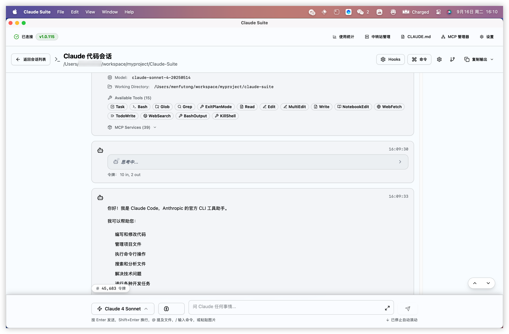

# Claude Suite

> Claude CLI 桌面管理工具 - macOS 版本
>
> 🎯 **本版本修复内容**：
> 1. 修复 macOS DMG 应用无法检测 Claude CLI 版本的问题
> 2. 优化 macOS 应用环境变量和 PATH 检测机制
> 3. 改善 NVM 安装的 Claude CLI 识别和默认选择逻辑
> 4. 完善 macOS 打包和分发流程

[](https://github.com/lucasmen9527/claude-suite/releases)
[](LICENSE)
[](https://github.com/lucasmen9527/claude-suite)

## ✨ 核心功能特性

### 📁 智能项目管理
- 可视化管理所有 Claude Code 项目
- 项目活动时间追踪和会话历史
- 一键创建新的 Claude Code 会话
- 项目路径智能识别和管理

### 💬 强大的 AI 交互界面
- 实时流式 Claude 响应显示
- 支持 15+ 专业开发工具 (Task、Bash、Glob、Grep、Read、Edit、Write 等)
- 完整的 MCP (Model Context Protocol) 支持 (39个服务)
- Markdown 渲染和代码语法高亮
- 多模型支持 (Claude 4 Sonnet 等)

### 📊 详细使用统计分析
- 实时费用监控和成本分析
- Token 使用量统计 (输入/输出)
- 会话数量和使用趋势
- 热门项目和模型使用分析
- 平均会话成本计算

### ⚙️ 完整配置管理
- 环境变量可视化管理
- API 令牌和基础 URL 配置
- Claude CLI 参数自定义
- 一键添加/编辑/删除配置项

### 🍎 macOS 深度优化
- 智能 PATH 检测，自动扫描 NVM、Homebrew 环境
- 解决 DMG 应用环境变量限制问题
- 原生 macOS 用户体验和权限管理
- 标准 DMG 安装包，支持系统集成

## 📸 应用截图

| 主界面 | 项目管理 |
|:---:|:---:|
|  |  |

| Claude 交互界面 | 使用情况仪表板 |
|:---:|:---:|
|  |  |

| 设置与配置 |
|:---:|
|  |

## 🚀 快速开始

### 系统要求

- **操作系统**: macOS 11.0+ (Big Sur 或更高版本)
- **Node.js**: 18.0+ (推荐通过 NVM 安装)
- **Claude CLI**: 需要预先安装 Claude CLI (`npm install -g @anthropic-ai/claude-code`)

### 安装方式

#### 方式一：下载预构建版本 (推荐)
1. 前往 [Releases 页面](https://github.com/lucasmen9527/claude-suite/releases)
2. 下载 macOS 安装包：`Claude Suite_x.x.x_aarch64.dmg`
3. 双击 DMG 文件，将应用拖拽到 Applications 文件夹
4. 首次运行时，可能需要在"系统偏好设置 → 安全性与隐私"中允许应用运行

#### 方式二：从源代码构建
```bash
# 克隆仓库
git clone https://github.com/lucasmen9527/claude-suite.git
cd claude-suite

# 安装依赖 (推荐使用 Bun)
bun install

# 开发模式运行
bun run tauri dev

# 构建生产版本 (macOS)
bun run tauri build
```

## 📖 使用指南

### 初次启动
1. 启动 Claude Suite
2. 应用会自动检测您的 Claude CLI 安装
   - 支持 NVM 安装的 Claude CLI (`~/.nvm/versions/node/*/bin/claude`)
   - 支持 Homebrew 安装的 Claude CLI
   - 支持全局 npm 安装的 Claude CLI
3. 如果检测到多个安装，会自动选择最优版本
4. 设置您的项目目录和偏好设置

### 代理商配置
1. 打开**设置** → **代理商**标签
2. 点击**添加代理商**配置您的 API 提供商
3. 填写代理商信息：
   - **名称**: 代理商的显示名称
   - **描述**: 可选的描述信息
   - **API 地址**: 代理商的 API 基础URL
   - **认证Token** 或 **API Key**: 至少填写其中一项
   - **模型**: 可选的默认模型

### 项目管理
- **创建项目**: 在主界面点击"新建项目"
- **会话管理**: 每个项目支持多个会话，保持上下文连续性
- **检查点系统**: 关键节点自动保存，支持回滚操作

## 🔧 故障排除

### Claude CLI 检测问题
如果应用显示"Claude CLI not found"：

1. **检查 Claude CLI 安装**:
   ```bash
   which claude
   claude --version
   ```

2. **通过 NVM 安装** (推荐):
   ```bash
   npm install -g @anthropic-ai/claude-code
   ```

3. **手动指定路径**: 在设置中选择正确的 Claude CLI 安装路径

4. **刷新检测**: 点击左上角状态指示器的刷新按钮

## 🛠️ 技术架构

### 前端技术栈
- **React 18** - 现代化的用户界面框架
- **TypeScript** - 类型安全的开发体验
- **Tailwind CSS 4** - 实用优先的 CSS 框架
- **Framer Motion** - 流畅的动画效果
- **i18next** - 国际化支持

### 后端技术栈
- **Tauri 2** - 现代化的桌面应用框架 (macOS 优化)
- **Rust** - 高性能的系统编程语言
- **SQLite** - 嵌入式数据库
- **macOS API** - 原生 macOS 系统集成

### 核心架构
```
┌─────────────────┐    ┌─────────────────┐    ┌─────────────────┐
│   React 前端    │◄──►│   Tauri 桥接    │◄──►│   Rust 后端     │
│                 │    │                 │    │                 │
│ • UI 组件       │    │ • IPC 通信      │    │ • Claude CLI    │
│ • 状态管理      │    │ • 安全调用      │    │ • 进程管理      │
│ • 路由系统      │    │ • 类型安全      │    │ • macOS API     │
└─────────────────┘    └─────────────────┘    └─────────────────┘
```

## 🤝 贡献指南

我们欢迎所有形式的贡献！

### 开发环境准备
1. Fork 本仓库到您的 GitHub 账户
2. 克隆您的 Fork 到本地
3. 安装依赖：`bun install`
4. 启动开发服务器：`bun run tauri dev`

### 提交规范
- 使用清晰的提交信息
- 遵循现有的代码风格
- 添加适当的测试覆盖
- 更新相关文档

### 报告问题
- 使用 [Issue 模板](https://github.com/lucasmen9527/claude-suite/issues/new) 报告 Bug
- 提供详细的复现步骤和环境信息
- 附加相关的日志文件和截图

## 📝 更新日志

### v1.1.5 (2024-09-16) - macOS 修复版
- 🐛 修复 macOS DMG 应用无法检测 Claude CLI 版本的关键问题
- 🔧 优化 macOS 应用环境变量和 PATH 检测机制
- 🎯 改善 NVM 安装的 Claude CLI 识别和默认选择逻辑
- 📦 完善 macOS 打包和分发流程
- ✨ 增强跨平台兼容性和稳定性

## 📄 许可证

本项目基于 [MIT License](LICENSE) 开源协议发布。

## 🙏 致谢

### 项目灵感和贡献

本项目基于多个优秀开源项目的启发和技术积累，特此感谢：

#### 🚀 核心架构来源
- **原项目架构**: [@getAsterisk/claudia](https://github.com/getAsterisk/opcode) - 提供了基础架构和设计思路

#### 🏆 社区贡献和启发

**Linux.do 社区的杰出贡献者们**：

- **[xiniah](https://linux.do/u/xiniah) 大佬** - 原创项目作者
  - 📝 社区帖子：[【已停止更新，请看最新消息】Claude Suite: 基于claudia 一体化管理claude code](https://linux.do/t/topic/838591/136)
  - 🔗 原始开源项目：[claude-suite](https://github.com/xinhai-ai/claude-suite)
  - 💡 为本项目提供了完整的功能设计和实现基础

- **[anyme](https://linux.do/u/anyme) 大佬** - Windows 版本开发者
  - 📝 社区帖子：[[8月2日更新] Claude Workbench - 让 windows 使用 Claude Code更加高效便捷！](https://linux.do/t/topic/799521)
  - 🔗 GitHub 仓库：[claude-workbench](https://github.com/anyme123/claude-workbench)
  - 🛠️ 为跨平台开发提供了宝贵的技术参考

#### 🔧 技术栈致谢
- **[Claude](https://claude.ai/)** - 强大的 AI 助手，让开发更高效
- **[Tauri](https://tauri.app/)** - 现代化的桌面应用框架
- **[React](https://react.dev/)** - 用户界面构建库
- **[Rust](https://rust-lang.org/)** - 系统编程语言
- **[Bun](https://bun.sh/)** - 高性能的 JavaScript 运行时

#### 🍎 macOS 特别优化
- 本版本专门针对 macOS 平台进行了深度优化
- 解决了 DMG 应用环境变量检测的关键技术难题
- 改善了 NVM 和 Homebrew 环境下的 Claude CLI 识别

### 开源精神
感谢所有为开源社区做出贡献的开发者们。正是因为大家的无私分享，才让我们能够站在巨人的肩膀上，创造更好的工具。

## 📞 联系方式

- **Issues**: [GitHub Issues](https://github.com/lucasmen9527/claude-suite/issues)
- **Discussions**: [GitHub Discussions](https://github.com/lucasmen9527/claude-suite/discussions)

---

<div align="center">
  <p>🍎 专为 macOS 用户优化的 Claude CLI 管理工具</p>
  <p>如果这个项目对您有帮助，请考虑给我们一个 ⭐</p>
  <p>Made with ❤️ for macOS users</p>
</div>